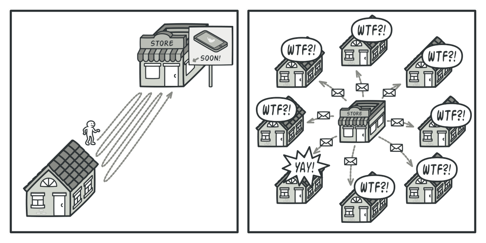
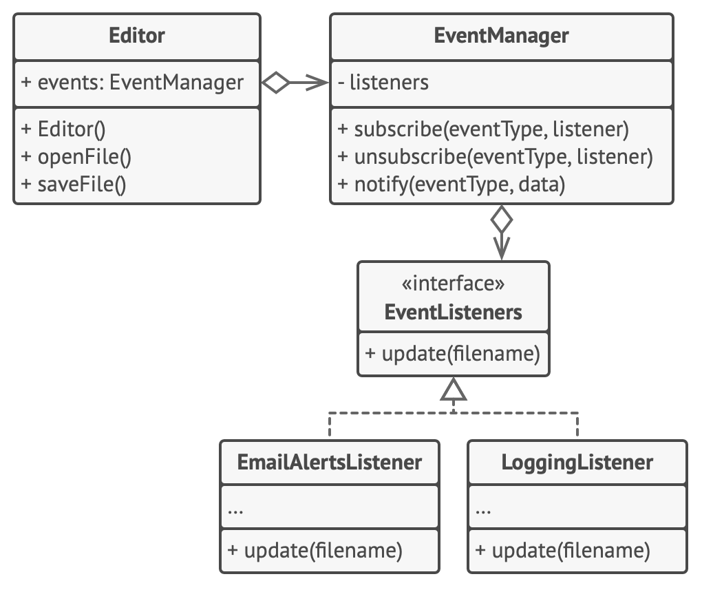

# Observer

**Hay còn được gọi là:** Event-Subscriber, Listener

Độ phức tạp: ★★☆

Độ phổ biến: ★★★

## **🎯 Mục đích**

**Observer** cho phép bạn định nghĩa một cơ chế đăng ký để thông báo cho nhiều đối tượng về bất kỳ sự kiện nào xảy ra với đối tượng mà chúng quan sát.


---

## **❓ Vấn đề**

Hãy tưởng tượng rằng bạn có hai object: `Customer` và `Store`. Khách hàng thì rất quan tâm đến một thương hiệu sản phẩm (ví dụ là một mẫu iPhone mới) sẽ sớm có mặt tại cửa hàng.

Khách hàng sẽ tới cửa hàng mỗi ngày để xem có hàng chưa. Nhưng sản phẩm vẫn đang trên đường về hàng, cho nên hầu hết những chuyến đi tới cửa hàng đều trở nên vô nghĩa.



Mặt khác, cửa hàng có thể gửi một đống email (có thể xem là thư rác) tới tất cả khách hàng mỗi khi có sản phẩm mới. Điều này có thể sẽ giúp ích với những khách hàng hay tới cửa hàng để kiểm tra có hàng chưa. Đồng thời nó cũng làm những người không quan tâm đến sản phẩm cảm thấy khó chịu.

Có vẻ như đang có xung đột. Hoặc là khách hàng lãng phí thời gian đến cửa hàng kiểm tra tình trạng sản phẩm. Hoặc là cửa hàng lãng phí tài nguyên khi gửi mail đến những người không quan tâm đến sản phẩm.

---

## **✅ Giải pháp**

Một đối tượng có một số trạng thái thú vị gọi là _subject_, nhưng bởi vì nó sẽ thông báo cho các đối tượng khác về sự thay đổi trạng thái của nó nên ta sẽ gọi nó là _publisher_. Tất cả những đối tượng khác muốn theo dõi sự thay đổi trạng thái của _pulisher_ được gọi là _subscribers_.

Observer pattern gợi ý bạn thêm một cơ chế đăng ký vào class publisher để các đối tượng khác có thể đăng ký hoặc huỷ đăng ký đối với các sự kiện đến từ publisher. Đừng sợ, mọi thứ sẽ không phức tạp như vậy. Trong thực tế, cơ chế này bao gồm:

1. Một mảng chứa danh sách các tham chiếu tới các đối tượng subscriber.
2. Một số public method để thêm, xoá subcriber khỏi mảng đó.


Bây giờ mỗi khi một sự kiện quan trọng nào xảy ra đối với publisher, nó sẽ đi qua các subcriber và gọi một method thông báo cụ thể nào đó trên các object đó.

Những ứng dụng thực tế có thể có hàng tá class subscriber khác nhau cùng theo dõi những sự kiện trên cùng một class publisher. Bạn sẽ không muốn ghép class publisher với tất cả các class đó. Ngoài ra, bạn thậm chí có thể không biết trước được một vài trong số chúng nếu class publisher được sử dụng bởi người khác.

Đó là lý do tại sao tất cả subscriber phải triển khai cùng một interface và publisher chỉ giao tiếp với chúng thông qua interface. Interface này sẽ phải khai báo một method thông báo với một số tham số mà publisher có thể sử dụng để truyền một vài dữ liệu cùng với thông báo.


Nếu ứng dụng của bạn có một vài class publisher khác nhau và bạn muốn làm cho subcriber tương thích với tất cả chúng, bạn có thể tiến xa hơn là làm cho tất cả publisher phải tuân theo một interface. Interface này chỉ cần mô tả một vài method đăng ký. Interface này sẽ cho phép các subscriber quan sát trạng thái của publisher mà không cần kết nối với các class cụ thể của chúng.

---

## **🌏 Liên hệ thực tế**


Nếu bạn đăng ký một báo hay một tạp chí, bạn sẽ không còn phải đi tới cửa hàng để kiểm tra xem nó có số tiếp theo hay không. Thay vào đó, các nhà xuất bản sẽ gửi số tiếp theo trực tiếp vào hộp thư của bạn ngay sau khi xuất bản hoặc thậm chí là trước khi xuất bản.

Nhà xuất bản sẽ duy trì một danh sách khách hàng đã đăng ký và biết họ có hứng thú với tạp chí nào. Khách hàng có thể rời khỏi danh sách đó khi họ muốn nhà xuất bản không gửi số tiếp theo cho họ nữa.

---

## **🏢 Cấu trúc**


1. **Publisher** sẽ đưa ra các sự kiện mà các đối tượng khác quan tâm. Những sự kiện này xảy ra khi publisher thay đổi trạng thái của nó hoặc thực hiện một hành động nào đó. Publisher chứa các phương thức đăng ký cho phép subcriber mới có thể tham gia vào và subcriber hiện tại có thể rời khỏi danh sách.
2. Khi có một sự kiện mới xảy ra, publisher sẽ duyệt qua danh sách subscriber và gọi method thông báo đã được khai báo bên trong subscriber interface cho mỗi đối tượng subcriber.
3. Interface **Subscriber** khai báo một interface thông báo. Trong hầu hết trường hợp, nó báo gồm một method `update` duy nhất. Method này có thể có vài tham số để cho publisher truyền vào một số chi tiết của sự kiện cập nhật.
4. **Concrete Subscribers** thực hiện một số hành động để phản hồi lại thông báo do publisher gửi đến. Tất cả những class này phải được triển khai cùng một interface để publisher không phải ghép với một lớp cụ thể nào.
5. Thông thường, subscriber cần một số thông tin theo ngữ cảnh để xử lý việc cập nhật một cách chính xác. Vì lí do đó, publisher thường truyền một vài dữ liệu làm đối số của method thông báo. Publisher có thể chuyển chính nó làm đối số, cho phép subcriber có thể sử dụng trực tiếp bất kỳ dữ liệu cần thiết nào.
6. **Client** tạo publisher và subcriber riêng lẻ và sau đó đăng ký subsciber nhận các cập nhật từ publisher.

---

## **👨‍💻 Code**

Trong ví dụ này, **Observer** pattern cho phép đối tượng soạn thảo vằn bản thông báo đến các đối tượng khác về sự thay đổi trạng thái của nó.



Danh sách subscriber là danh sách động: các đối tượng có thể bắt đầu hoặc ngừng lắng nghe thông báo khi chạy ở runtime, tuỳ thuộc vào hành vi mong muốn của ứng dụng của bạn.

Trong ví dụ này, Editor class sẽ không duy trì danh sách đăng ký bởi chính nó. Nó uỷ quyền công việc này cho một class đặc biệt dành riêng cho việc đó. Bạn cũng có thể nâng cấp object này hoạt động như một trung tâm điều phối sự kiện, để bất kỳ object nào cũng có thể đóng vai trò publisher.

Việc thêm subscriber mới vào chương trình không yêu cầu thay đổi các publisher hiện có miễn là chúng hoạt động với tất cả subscriber thông qua một interface.

```typescript
// Class base publisher bao gồm quản lý đăng ký và
// phương thức thông báo
class EventManager {
  private listeners: Map<string, EventListener[]>;

  constructor() {
    this.listeners = new Map<string, EventListener[]>();
  }

  public subscribe(eventType: string, listener: EventListener): void {
    if (!this.listeners.has(eventType)) {
      this.listeners.set(eventType, []);
    }
    this.listeners.get(eventType)?.push(listener);
  }

  public unsubscribe(eventType: string, listener: EventListener): void {
    const eventListeners = this.listeners.get(eventType);
    if (eventListeners) {
      const index = eventListeners.indexOf(listener);
      if (index !== -1) {
        eventListeners.splice(index, 1);
      }
    }
  }

  public notify(eventType: string, data: any): void {
    const eventListeners = this.listeners.get(eventType);
    if (eventListeners) {
      eventListeners.forEach((listener) => listener.update(data));
    }
  }
}

// Publisher cụ thể chứa logic mà các subscriber quan tâm.
// Chúng ta có thể lấy được class này từ class base publisher
// nhưng điều đó không phải lúc nào cũng khả thi trong thực tế
// bởi vì publisher cụ thể có thể đã là một sub class.
// Trong trường hợp này, bạn có thể vá logic đăng ký
// bằng composition như dưới đây.

class Editor {
  public events: EventManager;
  private file: File;

  constructor() {
    this.events = new EventManager();
    this.file = new File();
  }

  // Các logic nghiệp vụ có thể thông báo cho các subscriber
  // về sự thay đổi.
  public openFile(path: string): void {
    this.file = new File(path);
    this.events.notify("open", this.file.name);
  }

  public saveFile(): void {
    this.file.write();
    this.events.notify("save", this.file.name);
  }

  // ...
}

// Đây là interface subcriber. Nếu ngôn ngữ lập trình bạn sử dụng
// có hỗ trợ functional types, bạn có thể thay thế toàn bộ hệ
// thống phân cấp subscriber bằng các function.
interface EventListener {
  update(filename: string): void;
}

// Các subscriber cụ thể phản ứng với các cập nhật của publisher
// mà chúng được gắn vào
class LoggingListener implements EventListener {
  private log: File;
  private message: string;

  constructor(log_filename: string, message: string) {
    this.log = new File(log_filename);
    this.message = message;
  }

  public update(filename: string): void {
    this.log.write(this.message.replace("%s", filename));
  }
}

class EmailAlertsListener implements EventListener {
  private email: string;
  private message: string;

  constructor(email: string, message: string) {
    this.email = email;
    this.message = message;
  }

  public update(filename: string): void {
    system.email(this.email, this.message.replace("%s", filename));
  }
}

// Một ứng dung có thể cấu hình publisher và subscriber khi chạy
class Application {
  public config(): void {
    const editor = new Editor();

    const logger = new LoggingListener(
      "/path/to/log.txt",
      "Someone has opened the file: %s"
    );
    editor.events.subscribe("open", logger);

    const emailAlerts = new EmailAlertsListener(
      "admin@example.com",
      "Someone has changed the file: %s"
    );
    editor.events.subscribe("save", emailAlerts);
  }
}
```

---

## **💡 Ứng dụng**

🔅 **Sử dụng Observer pattern khi thay đổi trạng thái của một đối tượng có thể yêu cầu thay đổi các đối tượng khác và tập hợp các đối tượng không được biết trước hoặc thay đổi linh hoạt.**

Bạn có thể thường gặp vấn đề này khi làm việc với các class UI. Ví dụ, bạn tạo các class custom button và bạn muốn cho phép client thêm một số đoạn code vào các button đó để kích hoạt bất cứ khi nào mà người dùng bấm vào button.

Observer pattern cho phép bất cứ đối tượng nào triển khai một subscriber interface đăng ký nhận thông báo sự kiện từ đối tượng publisher. Bạn có thể thêm cơ chế đăng ký vào các button của mình, để client tuỳ chỉnh code của họ thông qua các class subscriber tuỳ chỉnh.

🔅 **Sử dụng Observer pattern khi vài đối tượng trong ứng dụng của bạn phải quan sát những đối tượng khác nhưng chỉ trong thời gian giới hạn hoặc những trường hợp cụ thể.**

Danh sách đăng ký sự kiện là động, cho nên subscriber có thể đăng ký hoặc bỏ đăng ký khi cần.

---

## **📋 Cách triển khai**

1. Nhìn qua logic của bạn và cố gắng chia code làm hai phần: chức năng chính, tách biệt với phần còn lại, sẽ là publisher; phần còn lại sẽ chuyển thành các class subscriber.
2. Khai báo subscriber interface. Ở mức tối thiểu, nó nên có một method `update` duy nhất.
3. Khai báo publisher interface và mô tả một vài method để thêm, xoá subscriber từ danh sách subscriber. Nhớ rằng publisher chỉ làm việc với subscriber thông qua subscriber interface.
4. Quyết định nơi đặt danh sách đăng ký thực tế và triển khai các phương thức đăng ký. Thông thường đoạn code này giống nhau đối với tất cả loại publisher, do đó vị trí để đặt nó là trong một abstract class lấy trực tiếp từ publisher interface. Các publisher extend class đó, kế thừa hành vi đăng ký.
   Tuy nhiên, nếu bạn đang áp dụng pattern này cho một hệ thống phân cấp lớp hiện có, hãy xem xét cách tiếp cận dựa trên composition: đưa các logic đăng ký vào một đối tượng riêng biệt và các publisher sử dụng nó.
5. Tạo một class publisher cụ thể. Mỗi lần có gì quan trọng xảy ra bên trong publisher, nó sẽ thông báo tới các subscriber của nó.
6. Triển khai phương thức thông báo cập nhật trong các class subscriber. Hầu hết các subscriber sẽ cần một số dữ liệu ngữ cảnh về sự kiện. Nó có thể được truyền dưới dạng đối số của method thông báo.
   Nhưng có một lựa chọn khác. Khi nhận được thông báo, subscriber có thể lấy dữ liệu trực tiếp từ thông báo. Trong trường hợp này, publisher phải tự chuyển chính nó qua method update. Lựa chọn kém linh hoạt hơn là liên kết vĩnh viễn publisher thông qua constructor.
7. Client phải tạo tất cả subscriber cần thiết và đăng ký chúng với publisher thích hợp.

---

## **⚖ Ưu điểm và nhược điểm**

### Ưu điểm

✔ Nguyên tắc _Open/Closed_. Bạn có thể thêm class subscriber mới mà không cần thay đổi code trong publisher nếu có một publisher interface.

✔ Bạn có thể thiết lập quan hệ giữa các đối tượng trong runtime.

### Nhược điểm

❌ Subscriber được thông báo theo thứ tự ngẫu nhiên.
